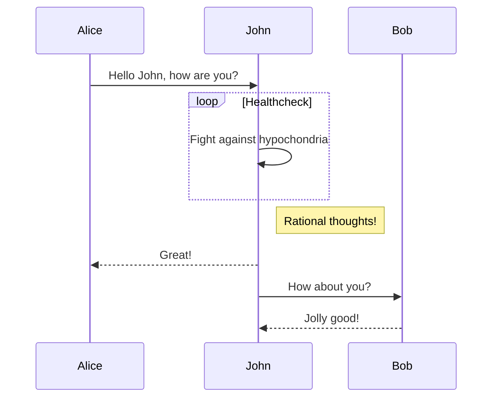

# Daniel Maestre - Portfolio

Guide to execute the code of this Portfolio

---

## Client side setup

You should execute these commands inside `/client` folder. Node.js is required, preferably ^18.12.x.

* Install dependencies: `npm install`
* Run local server for development. Also compiles and hot-reloads: `npm run serve`
* Compile and minify for production (needed for deployment in remote server): `npm run build`
* Linter: `npm run lint`

## Server side setup

You should execute these commands in root folder `/Portfolio-Daniel-Maestre`. Python is required, preferably ^3.10.x.

* Create virtual environment for Python: `python -m venv venv/`
* Activate venv: `\venv\Scripts\activate.bat` (Windows CMD) or `.\\venv\Scripts\Activate.ps1` (Windows PowerShell) or `source venv/bin/activate` (Mac OS)
* Install dependencies: `pip install -r requirements.txt`
* Run local server for development: `python manage.py runserver`

<!-- ### Customize configuration -->
<!-- See [Configuration Reference](https://cli.vuejs.org/config/). -->

## Updating dependencies

A good practice is updating the dependencies, so the project benefits from bug fixes and security issues are prevented.

### Django

* Check outdated dependencies in Django: `pip list --outdated`
* Update requirements.txt
* Upgrade packages: `pip install -r requirements.txt --upgrade`

### Node

* Update node_modules: `npm update`

Check that the environment is not breaking the project!

## Some Code

```js
function(x){
  getPortfolioAPI();
  return true;
}
```

## Flow Diagram


